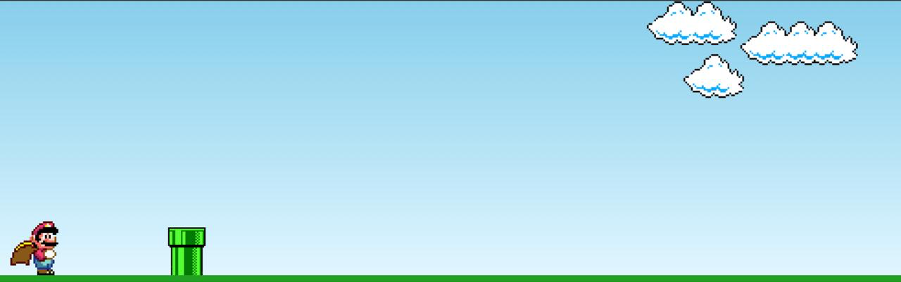

# 🎮 Mario Jump

Jogo estilo infinite runner inspirado no clássico Super Mario Bros, onde o jogador controla o Mario para pular canos sem parar até encerrar o jogo.

  

## 📝 Descrição

Mario Jump é um jogo simples desenvolvido com HTML, CSS e JavaScript. O objetivo é sobreviver o maior tempo possível, evitando obstáculos que aparecem continuamente na tela.

## 🚀 Funcionalidades

🎯 Movimentação: Pressione qualquer tecla para fazer o Mario pular.

💥 Detecção de colisão: O jogo termina ao encostar em um cano (Game Over).

🎨 Animações CSS: Salto, movimento dos canos e nuvens.

🎵 Áudio: Música tema em loop e  efeitos sonoros para pular e Game Over.

## 🛠 Tecnologias Utilizadas

🌐 HTML5

🎨 CSS3 (Flexbox, keyframes)

💻 JavaScript (DOM, Eventos, Audio API)
   
## 🚀 Como Executar

Clone este repositório:

git clone https://github.com/Victor-Diniz-Dev/mario-jump.git

Navegue até a pasta do projeto e inicie um servidor local (por exemplo, Live Server no VSCode) ou abra index.html diretamente no navegador.

Com a página carregada, o jogo iniciará automaticamente.
